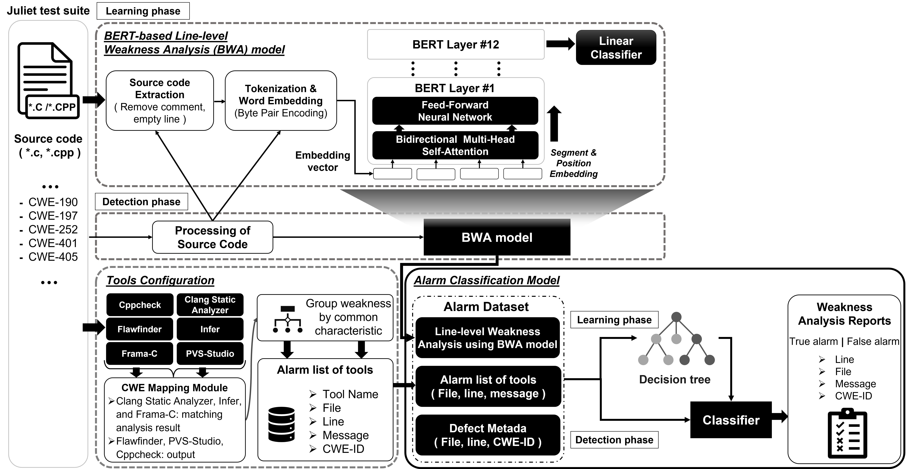
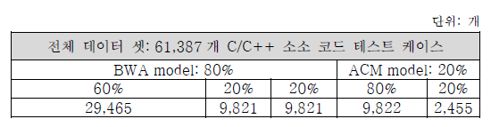
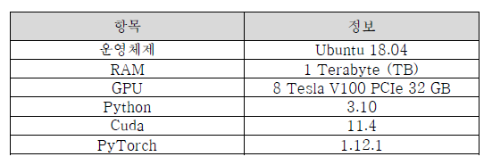
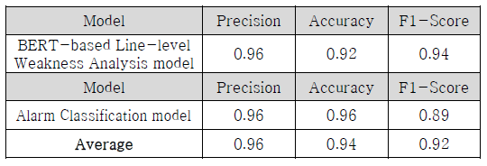
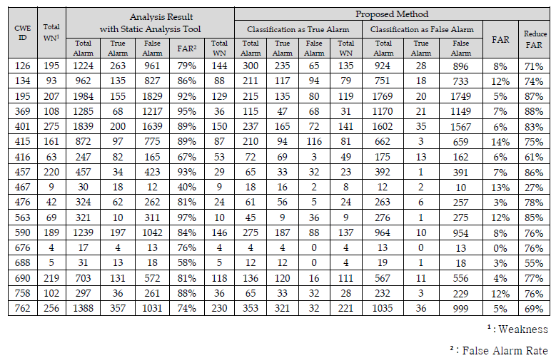

b# FalseAlarmReduceResearch
False Alarm Reduce Research for Weakness Analyzer
> (MDPI, applied sciences'23) False Alarm Reduction Method for Weakness Static Analysis Using BERT Model </br>
> Dinh Huong Nguyen, Aria Seo, Nnubia Pascal Nnamdi and Yunsik Son

## 프로젝트 소개
- 정적 분석 도구는 소스 코드를 검사하여 보안약점으로 탐지된 소스 코드의 위치, 특징과 같은 추가적인 상황 정보를 보여주는 진단 메시지(“경고”)를 생성한다. 각각의 정적 분석 도구는 진단 가능한 보안약점의 종류와 분석 성능이 다르기 때문에, 소프트웨어 개발 시에는 다양한 정적 분석 도구를 사용하는 것이 일반적이다. 하지만, 이러한 방식은 보안약점을 많이 탐지하며 알람을 생성하지만, 오탐 알람을 다수 발생시킨다는 문제가 존재한다.
- 개발자가 작성한 다양한 소스 코드 내에서 구문 또는 의미 분석이 어려운 문제가 있다. 이를 해결하기 위해 소스 코드의 sequence나 semantic의 관계에 대한 처리가 잘되는 Transformer 아키텍처 기반으로 BERT 모델을 사용하여 보안약점 탐지 정확도를 향상하고자 한다.
- 본 연구에서는 BERT 모델을 사용하여 각 라인별로 보안약점 발생 가능성에 대한 점수를 계산하고, 다수의 정적 분석 도구가 생성하는 보안약점 분석결과의 신뢰도를 결정 트리 모델로 분류함으로써 오탐율을 감소시키는 시스템을 제안한다.
- 또한, 다수의 정적 분석 도구가 가지는 장점을 유지하고 딥러닝의 장점을 같이 결합하여 보안약점을 정확하게 분석하고자 한다. 이후, 프로그램 내의 보안약점을 온전히 검사하면서도 오탐율을 효과적으로 감소시켜, 프로그램 개발 및 리뷰과정에서 소요되는 비용과 시간을 줄이는 기법을 제안한다.
- BERT 모 델을 이용한 보안약점 정적 분석 오탐 경감 모델의 아키텍쳐는 다음과 같다.

<p align="center">
  
  <span>BERT 모델을 이용한 보안약점 정적 분석 오탐 경감 모델</span>
</p>

## 프로젝트 구조
  - BERT 모델을 이용한 라인별로 보안약점을 분석 모델 (BWA): BERT 모델을 이용한 라인별 보안약점 분석 모델(BWA)은 입력한 C/C++ 소스코드를 토큰화하고 임베딩한 후에 보안약점 패턴을 학습한 후에 분석하게 된다.
  - 다수 정적 분석 도구 선택 및 실험 (Tools Configuration): 여러 정적 분석 도구를 사용해서 소스 코드 내에 보안약점을 진단한다.
  - 보안약점 정적 분석 알람 분류 (Alarm Classification Model - ACM): BWA 모델을 통해 분석된 결과(라인별로 보안약점 발생 가능성 점수)와 다수의 정적 분석결과를 입력하고 Decision 트리 모델을 통해서 알람을 재 분류하는 것이다
## 프로젝트 환경 및 설치
### Dataset
- 본 연구에서 사용하는 데이터 셋은 U.S. American National Security Agency (NSA)의 Center for Assured Software (CAS)에서 개발되어 2010년 12월에 처음으로 발표된 Juliet test suite 이다. 이는 제어흐름, 데이터 흐름, 또는 사용 데이터 구조와 타입에 있어 특징이 있는 비교적 짧은 코드들로 구성되어 있다. 사용되는 Juliet test suite는 1.3버전이며 총 118개의 보안약점 클래스를 포함하고 있다. C, C++에서는 공식적으로 64,099개의 테스트 케이스를 포함하고 있으며, C 소스코드 53,476개, C++ 소스코드 46,276개가 포함되어 있다. C/C++ 헤더파일 4,422총 104,174개의 파일이 포함되어 있다. [Juliet test suite](https://samate.nist.gov/SARD/test-suites/112)
- 데이터 셋을 다운로드 한 다음에 ***dataset*** 폴더에서 저장하세요.
### BWA
- 제세한 설치는 해당 모듈의 폴더에서 README.md 파일을 참고하세요.
- 개발 환경: anaconda, python 프로그래밍
### Tools Configuration
- 제세한 설치는 해당 모듈의 폴더에서 README.md 파일을 참고하세요.
- 개발 환경: python 프로그래밍
### Alarm Classification Model - ACM
- 제세한 설치는 해당 모듈의 폴더에서 README.md 파일을 참고하세요.
- 개발 환경: python 프로그래밍

## 프로젝트 실험
- 본 연구는 2개의 딥러닝 모델이 존재하기 때문에 처음 사용하는 Juliet test suite 데이터 셋을 분리하는 작업이 필요한다. <표 3-6>과 같이 총 60%, 80%의 데이터 셋은 각 모델의 훈련 데이터(Training dataset)이며, 20%는 검정 데이터 (Validation dataset) 및 테스터 데이터 (Testing dataset)로 사용되었다.
<p align="center">
  <br>
  <span>데이터 셋 분리</span>
</p>

- 개발한 프로젝트를 실험한 컴퓨터 사양 및 주로 패키지 정보에 대한 내용은 다음과 같다.
<p align="center">
  <br>
  <span>컴퓨터 사양 및 주로 패키지 정보</span>
</p>

## 프로젝트 평가
- 제안된 모델의 성능을 평가하기 위해 Precision, Accuracy, F1-Score와 ROC Curve에 대한 점수가 계산되었다. BWA 모델인 경우에는딥러닝 모델을 대표적인 평가 지표를 선택하며, ACM 모델인 경우에는 분류 모델에서 많이 사용하는 평가 지표를 선택하였다.

<p align="center">
  <br>
  <span>모델에 대한 평가 지표</span>
</p>

- CWE별로 제안된 모델을 적용해서 보안약점을 진단하는 결과는 다음과 같다.

<p align="center">
  <br>
  <span>모델에 대한 평가 지표</span>
</p>

## 논문
Please kindly cite our paper if it benefits:

```bib
@article{FalseAlarmReduceResearch,
author = {Dinh Huong Nguyen,Aria Seo,Nnubia Pascal Nnamdi andYunsik Son},
title = {False Alarm Reduction Method for Weakness Static Analysis Using BERT Model},
year = {2023},
publisher = {MDPI},
volume = {13},
issue = {6},
url = {https://doi.org/10.3390/app13063502},
doi = {10.3390/app13063502},
journal = {MDPI, Applied sciences},
numpages = {3502}
}
```

<h1 align="center">Thank you for my professor for support</h1>
