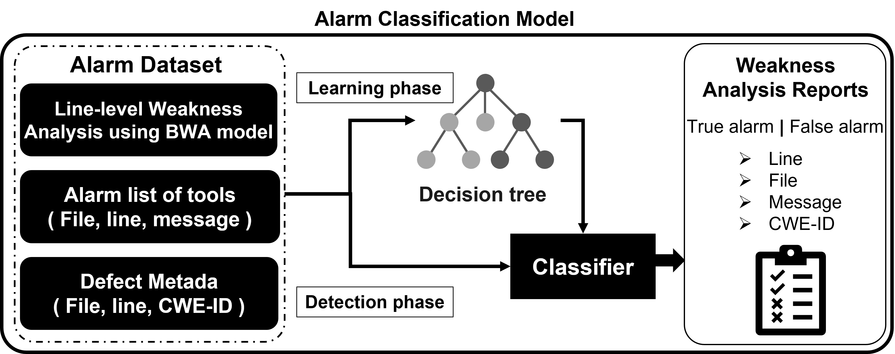
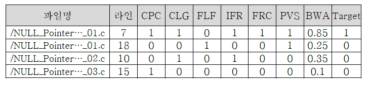

[Korean](./README(Korean).md)

# Alarm Classification Model - ACM
- The ACM receives the line-level vulnerability scores produced by the BWA model, along with the outputs from multiple static analysis tools, and classifies the alerts using a decision tree model.
- The architecture of the ACM model is shown below:

   
  Static Vulnerability Alarm Classification Model

- Once the BWA model is trained to analyze vulnerabilities using BERT and the experimental environment with multiple static analysis tools is established, a dataset is consructed.
- This dataset includes the analysis results from various static analysis tools, line-level attention scores from the BERT-based BWA model, and relevant metadata.
- Each data point corresponds to a test case file categorized by CWE. The following figure presents an example of the input data used for the alarm classification model.

    
  Sample input data for the alarm classification model

## Model Environment and Libraries
- Python 

## How to Run the Model
- Use the ***classification_models.ipynb*** file and run each step in the notebook to execute the model.

## Reference
- [Decision tree](https://scikit-learn.org/stable/modules/tree.html)