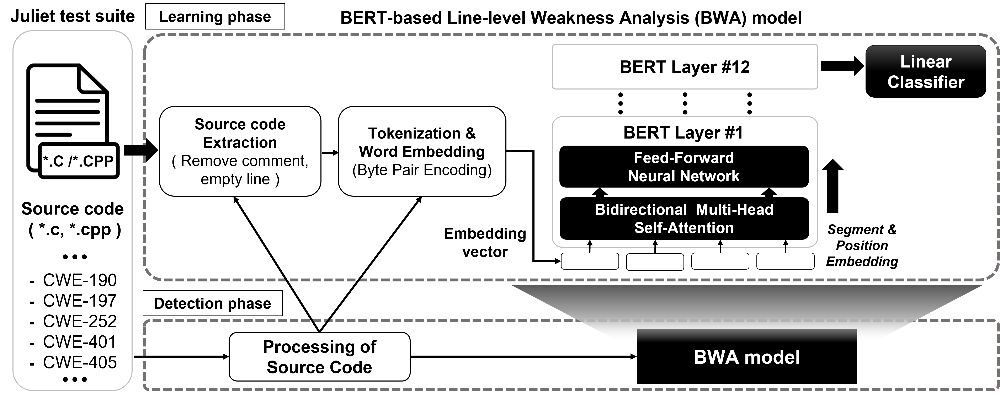

#  BERT 모델을 이용한 라인별로 보안약점을 분석 모델 (BWA)
- BERT 모델을 이용한 라인별 보안약점 분석 모델(BWA)은 입력한 C/C++ 소스코드를 토큰화하고 임베딩한 후에 보안약점 패턴을 학습한 후에 분석하게 된다.
- 해당 모델을 아키텍쳐는 다음과 같다.

<p align="center">
  
  <span>BERT 모델을 이용한 라인별 보안약점 분석 모델</span>
</p>

1. 훈련 및 테스트 데이터 셋을 준비한다.(juliet test suite c/c++ v1.3) 
2. 입력된 소스 코드는 데이터 정리, 정규화 및 특징 추출한다. 소스코드 내에서 코드 실행에 영향을 미치지 않거나 시스템에 보안약점을 유발하지 않는 불필요한 주석을 제거해야 한다.
3. 추출된 소스코드의 토큰화한다: 사전 훈련된 BERT 모델을 사용하려면 입력 데이터를 적절한 형식으로 변환하여 각 문장을 사전 훈련된 모델로 보내 해당 임베딩을 얻을 수 있도록 해야 한다. 해당 프로젝트에서 Byte Pair Encoding(BPE)를 이용해서 소스코드를 토큰환했다.
4. 토큰 및 포지션 임베딩: 코드 토큰의 의미와 입력 시퀀스(코드 또는 라인)에서 해당 위치를 캡처하는 인코딩 및 임베딩을 수행하는 것이다. BERT는 총 3개의 토큰 임베딩(token embedding), 세그먼트 임베딩(sentence embedding) 및 포지션 임베딩(position embedding) 레이어가 있다.
5. 모델 학습: 입력된 인코딩 벡터는 12개의 Encoder-only Transformer 레이어를 통과한다.
6. 결과 추론: BERT 모델의 출력된 결과는 각 토큰별로 자기의 포지션 정보 및 토큰간의 포지션에 대한 관계성을 얻게 되었다. 이후에 입력된 소스 코드 기준으로 라인별로 토큰을 집합한다. 라인을 다시 만들어서 각 라인의 토큰이 Linear Classifier 모델을 통해서 학습된 119클래스 (118 CWE 및 보안약점을 가지지 않을 클래스) 분류한다.
## 모듈 개발환경 및 라이브러리
- Python 
- torch
- transformers

## 모듈 실치 및 실행
1. 데이터 셋 준비
- julietsuite 폴더에서 juliet test suite 데이터 셋 다운로드
- C/C++ 소스코드부터 csv 파일 형태로 변경하고 labelling를 진행한다. (tools_configuration 및 bwa_model 모델별로 분리함)
```
python3 data_process.py
```
2. Terminal에서 명영어 실행
    - Training (훈련 데이터 및 검정 데이터 셋 파일 경로를 전달)
    ```
    python3 train.py --train_csv_path=dataset/train.csv \
                    --val_csv_path=dataset/val.csv \
                    --num_classes=120 \
                    --do_train \
                    --model_name_or_path="neulab/codebert-cpp" \
                    --epoch=10 \
                    --batch_size=16

    ```
    - Testing (테스트 데이터 셋 파일 경로를 전달)
    ```
    python3 test.py --csv_path=dataset/test.csv\
                    --num_classes=120\
                    --model_name_or_path='neulab/codebert-cpp'\
                    --save_predict="./pred.json"\
                    --ckpt=model.ckpt\
                    --batch_size=64
    ```
    - Output testing: Json 파일 형태로 출력함
    ``` 
    [
        {
            "prob_lines":prob_lines,
            "class_lines":class_lines,
            "source_code_lines_raw":source_code_lines_raw
        }
    ]
    ```
    
## 모듈 출력
- BERT 모델 기반으로 라인별로 보안약점 분석 결과를 출력한 예제이다.

<p align="center">
  <br>
  <span>BERT 모델 기반으로 라인별로 보안약점 분석 결과 예제</span>
</p>

    위에 표과 같이 점수는 보안약점을 발생 가능성에 대한 점수를 나타나며 점수가 높은 수록 해당 라인에서 보안약점 발생 가능성이 높다. 이미 학습된 데이터와 입력된 소스 코드를 비교하여 보안약점을 발생한 라인으로 7번째 라인이 분석되었다. 3번째하고 5번째 라인인 경우에는 “data”라는 변수를 선언하는 명령어를 가지기 때문에 점수가 높아진다. 주석 또는 중괄호 라인인 경우에는 보안약점이 일어날 수 없기 때문에 점수가 0이다.

## 모듈 로그
- 학습하는 동안 log 정보들을 ***train.log*** 파일에서 저장하게 됨

## 참고
- [BERT](https://arxiv.org/abs/1810.04805)
- [CodeBERT](https://github.com/microsoft/CodeBERT)