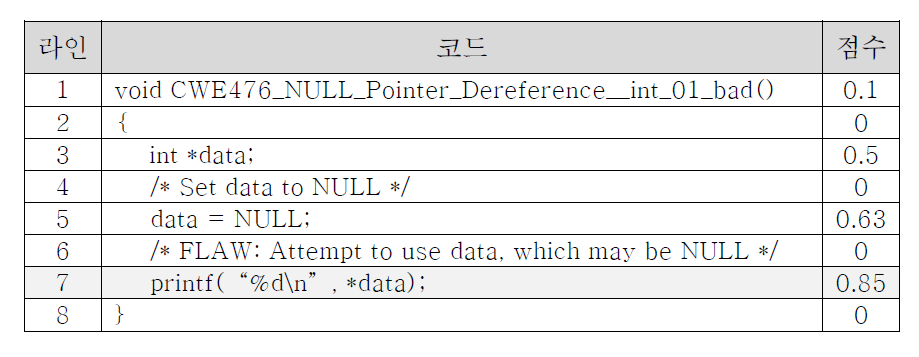

[Korean](./README(Korean).md)

# BWA: Line-Level Vulnerability Analysis Using BERT 
- The BWA (Bug Warning Analyzer) model performs line-level vulnerability analysis on input C/C++ source code using a BERT-based architecture.
- It tokenizes and embeds the input code, learns vulnerability patterns, and analyzes each line accordingly.
- The architecture of the model is shown below:

<p align="center">
  
  <span>Line-Level Vulnerability Analysis Model Using BERT</span>
</p>

## Workflow
1. Prepare training and tesing datasets
  - The model is trained and evaluated using the Juliet Test Suite v1.3 for C/C++
2. Data preprocessing and normalization
  - The input source code is cleaned, normalized, and essential features are extracted.
  - Comments that do not affect program execution or introduce vulnerabilities are removed during this step.
3. Tokenization of source code
  - To utilize a pre-trained BERT model, the input source code must be converted into an appropriate format.
  - Byte Pair Encoding (BPE) is used in this project to tokenize the source code.
4. Token and position embeddings
  - The tokenized input is encoded with both semantic and positional information.
  - BERT utilizes three embedding layers: **token embedding**, **segment embedding**, and **position embedding**
5. Model traiing
  - The encoded vectors are passed through 12 Encoder-only Transformer layers in the BERT model.
6. Inference
  - The output from BERT contains contextualized representations of each token, including position and relationship information.
  - Tokens are regrouped by source code lines. A linear classifier is then applied to each line to classify it into one of 119 classes (118 CWE classes + 1 non-vulnerable class).

## Environment & Libraries
- Python 
- torch
- transformers

## Installation & Execution
1. Prepare the Dataset
- Download the **Juliet Test Suite** dataset to the julietsuite folder
- Convert the C/C++ source code into CSV format and perform labeling.
  (Note: This process is separated for each module, such as tools_configuration and bwa_model)
```
python3 data_process.py
```
2. Run from Terminal
    - Training (Provide the file paths for training and validation datasets)
    ```
    python3 train.py --train_csv_path=dataset/train.csv \
                    --val_csv_path=dataset/val.csv \
                    --num_classes=120 \
                    --do_train \
                    --model_name_or_path="neulab/codebert-cpp" \
                    --epoch=10 \
                    --batch_size=16

    ```
    - Testing (Provide the file path for the test dataset)
    ```
    python3 test.py --csv_path=dataset/test.csv\
                    --num_classes=120\
                    --model_name_or_path='neulab/codebert-cpp'\
                    --save_predict="./pred.json"\
                    --ckpt=model.ckpt\
                    --batch_size=64
    ```
    - Output: The prediction results are saved as a JSON file
    ``` 
    [
        {
            "prob_lines":prob_lines,
            "class_lines":class_lines,
            "source_code_lines_raw":source_code_lines_raw
        }
    ]
    ```
    
## Model Output
- The following is an example of line-level vulnerability analysis output generated by the BERT-based model:

<p align="center">
  <br>
  <span>Example: Line-Level Vulnerability Scores from the BERT Model</span>
</p>

In the example above, the indicates the likelihood of a vulnerability occurring in each line. A higher score means a greater likelihood of a vulnerability on that line.
The model analyzes the source code by comparing it with previously learned patterns. For instace:
- Line 7 was flagged as vulnerable.
- Line 3 and 5 received relatively high scores because they contain variable declarations with "data". 
- Line containing only comments or braces were assigned a score of 0, as they are not considered potential vulnerability points.
위에 표과 같이 점수는 보안약점을 발생 가능성에 대한 점수를 나타나며 점수가 높은 수록 해당 라인에서 보안약점 발생 가능성이 높다. 이미 학습된 데이터와 입력된 소스 코드를 비교하여 보안약점을 발생한 라인으로 7번째 라인이 분석되었다. 3번째하고 5번째 라인인 경우에는 “data”라는 변수를 선언하는 명령어를 가지기 때문에 점수가 높아진다. 주석 또는 중괄호 라인인 경우에는 보안약점이 일어날 수 없기 때문에 점수가 0이다.

## Training Log
- During model training, log information is saved in the file train.log.

## References
- [BERT](https://arxiv.org/abs/1810.04805)
- [CodeBERT](https://github.com/microsoft/CodeBERT)