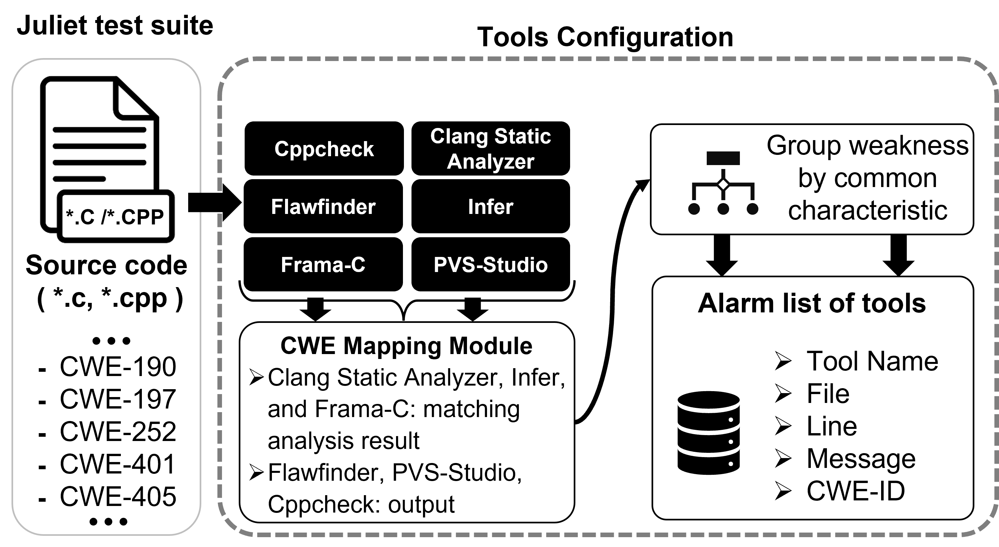

#  BERT 모델을 이용한 라인별로 보안약점을 분석 모델 (BWA)
- 다수 정적 분석 도구 선택 및 실험 (Tools Configuration): 여러 정적 분석 도구를 사용해서 소스 코드 내에 보안약점을 진단한다.
- 해당 모델을 아키텍쳐는 다음과 같다.

<p align="center">
  
  <span>BERT 모델을 이용한 라인별 보안약점 분석 모델</span>
</p>

## 모델 파일 구조
- 해당 모델을 구현하기 위해서 파일 구조는 다음과 같다.
```
- data: 데이터를 저장하는 폴더
- tmpData: 도구를 통해서 결과를 저장하는 폴더
- tools-usage: 도구별로 사용법 파일
- docker: Docker 환경을 실행하기 위해서 Docker 파일
- AnalyzeToolConfig: config 파일로 부터 설정한 정보를 받아서 도구를 paramater 및 option 설정
  - buildScannerList()
  - getCCppScannerList()
- CompareTool: 도구는 testsuite의 기존 문제 기반으로 진단되는 출력 결과을 비교함
- ComparisonResultHolder: Summary 비교하는 데 사용되는 단순한 일반 결과 홀더
- config.cfg: 프로젝트 Config 정보를 저장하는 파일
- convertTool: 여러 보안 검사기의 출력을 자체 형식으로 변환하는 도구 추가 처리에 필요함, 즉 출력되는 결과의 양식을 변환
- FlawCollector 처음에 juliet-suite 데이터를 받아서 취약점을 규칙 수집함
- HTMLReport 결과는 html 형식으로 변화해주는 파일 
- Issue Xml 파일 저장하기 위해서 Issue tag 클래스
- IssueComparisionResult Issue 정보를 만든 클래스
- IssueComparison Issue를 비교하는 클래스
- metricGenerator metric를 생성하는 클래스
- MSCompilerResultConverter
- py_common 파일을 작업 등 함수
- [main] runCompleteAnalysis main 함수 (실행 시작) 
- ScannerCWEMapping 스캐너 결과 cwe 매핑을 캡슐화하는 단순 클래스
- ScannerIssueHolder 전체 이슈 클래스보다 가볍움. 이슈 비교에 필요
- SecurityModel 시코딩 모델
- SecurityModelComparision  시코딩 모델 비교
- SecurityScanner 다양한 종류의 보안 스캐너를 캡슐화하기 위한 간단한 클래스, 즉 config에 기준으로 정보를 추가함
- TransformTool
- TestsuiteAnalyzer juliet-test-filename'에서 설정을 되는 분석 도구 run_analysis_tool
```

## 모델 실치 및 실행
각 도두들이 실행하는 방법은 다음과 같다.
1. Infer
- Makefile 파일을 통해서 각 보안약점 테스트 케이스 파일을 실행함
2. Clang
- clang.sh 파일 통해서 각 보안약점 테스트 케이스 파일을 실행함 (옵션을 추가해서 번그러워서 sh파일에서 작성함)
3. Cppcheck
- cppcheck 명령어를 통해서 각 보안약점 테스트 케이스 파일을 실행함
4. Flawfinder
- cppcheck 명령어를 통해서 각 보안약점 테스트 케이스 파일을 실행함
5. Framac
-  frama-c 명령어를 통해서 각 보안약점 테스트 케이스 파일을 실행함
6. PVS- Studio
-  pvs_studio.sh 파일을 통해서 각 보안약점 테스트 케이스 파일을 실행함

최종 실행 단계는 다음과 같다.
1. 데이터 준비 (도구 실행 앞에서 실행 파일 준비 또는 빌드 필요함)
- julietsuite 폴더에서 juliet-test-suite c/c++ 데이터 셋을 다운로드한다.
- python3 handle_make.py 실행
  - Infer
  - Clang
  - Cppcheck 

2. Python 코드를 통해서 모든 도구를 실행함
```
python3 TestsuiteAnalyzer.py
```
- 해당 명령어를 실행하게 되면 각 도구들이 1번에 생성된 실행 파일이나 빌드 파일을 사용해서 각 테스트 케이스 파일을 보안약점을 진단한다.
## 모델 출력

## 참고